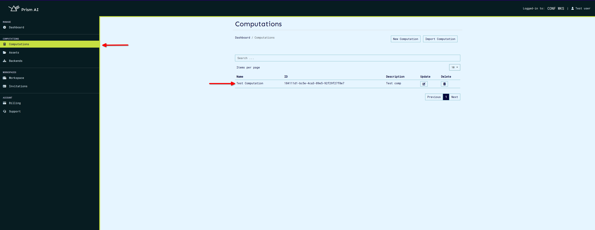
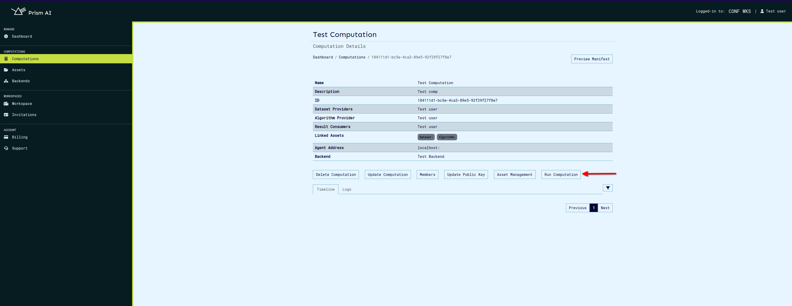
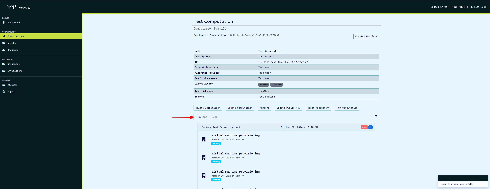
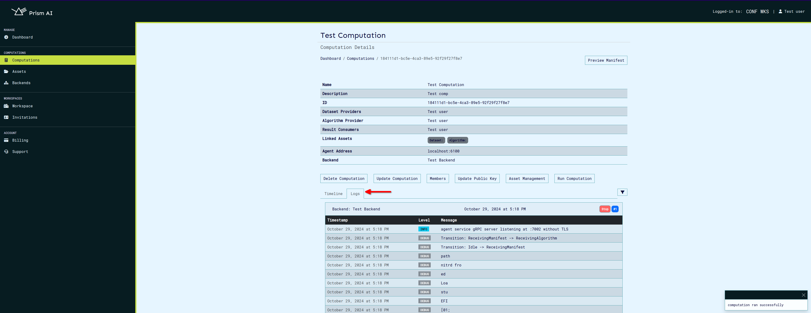
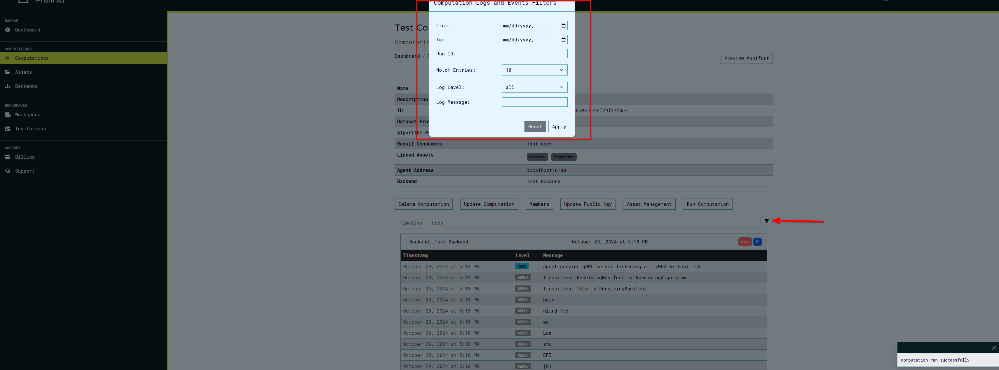
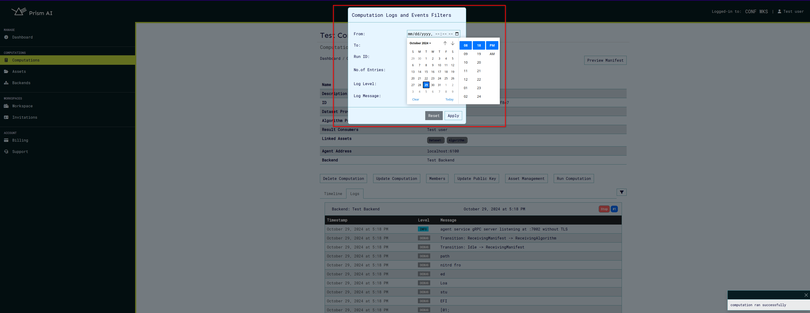
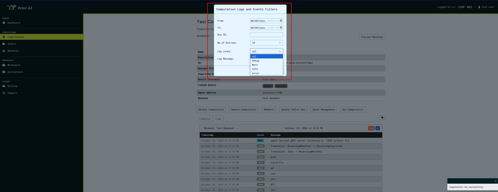
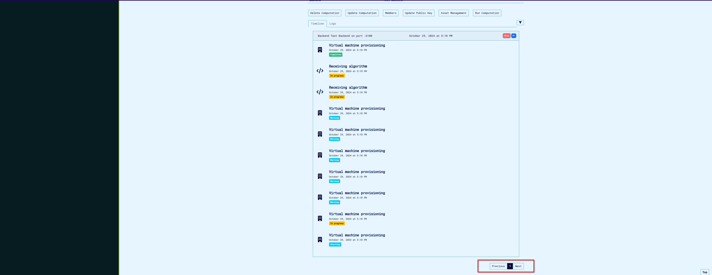

# Computation Logging and Monitoring

Monitoring and reviewing logs and events is crucial for understanding the flow, tracking performance, and diagnosing potential issues during a computation run.

Once a computation is successfully running, comprehensive logs and events are continuously updated in the UI. The Timeline and Logs tabs offer distinct perspectives: the Timeline provides a structured sequence of events, while the Logs tab offers in-depth logs from components like QEMU, Agent, and Manager. Together, these views provide essential insights into each stage of a computation's lifecycle.

A robust filtering system in the UI further enhances the monitoring experience, allowing you to narrow down to specific logs or events. This makes it easier to investigate issues or closely examine detailed stages within the computation.

## Viewing Logs

### 1. **Running a Computation to View logs and Events**

To access the logs and events associated with a computation, you must first successfully execute a computation.
Detailed steps for creating a computation, uploading necessary assets, and managing public keys are available in [computations](./computations.md) and [events](./assets.md) docs.

To run a computation, start by navigating to the Computations page, where you will see a list of available computations.
Select the computation you want to execute.

This action will direct you to the computation details page, as shown below:

Once selected, click on the "Run Computation" button, which initiates the computation process.

### 2. **Viewing Computation Logs and Events**

After successfully running a computation, the logs and events will populate in the "Timeline" and "Logs" sections on the computation page.
These sections allow you to switch between detailed computation events and logs.

To view these logs and events:

1. Timeline Tab:

   - This tab outlines the sequence of events for the computation, from the initial setup (such as VM provisioning) to completion, including downloading the computation results.
   - The timeline view provides an organized, event-by-event account of the computation’s progression.

2. Logs Tab:
   - This tab contains the detailed logs generated during the computation run.
   - Logs are segmented from various sources, including QEMU, Agent, and Manager logs.
   - Each source log offers insights into the specific processes and stages within the computation.

### 3. **Filtering Computation Logs and Events**

To streamline navigation and analysis, the UI includes a filtering feature, allowing you to filter logs and events by various criteria.
This feature makes it easier to follow the sequence of events in a computation or identify specific areas when debugging issues.

Using the Filter Feature:

1. Click on the filter (funnel) icon located in the logs/events section to open the filter modal.

2. In the modal, you’ll find options to refine your view:

   - Date Filter: Specify a date range to focus on logs and events from a specific period.
   - Log Level Filter: Filter by log level (e.g., error, warning, info) to see logs of a specific severity.
   - Run: Filter by run id to see logs and events of a specific computation run.
   - No. of Entries: Filter number of entries to specify number of logs and events displayed per page.
   - Each filter selection refines the logs/events displayed to only show relevant data based on the chosen criteria.

3. Click Apply to apply your selected filters to the logs/events view. To reset the filters back to their default state and show all logs/events, click the Reset button.

4. Navigating through Logs and Events Pages:
   - The logs and events are paginated to improve readability and ease of navigation.
   - To scroll through the log entries, use the Next and Previous buttons.
   - Each button allows you to move one page forward or backward through the logs, respectively, making it easier to locate specific entries without overwhelming the display.

