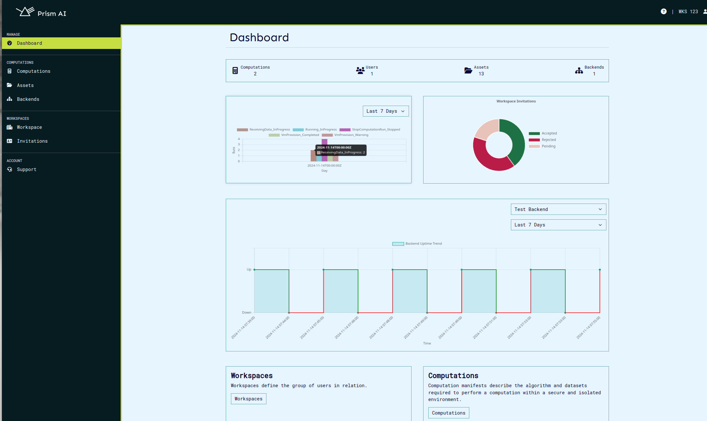

# Dashboard

The dashboard offers a summarized view of workspace elements, including users, backends, computations, and assets. It is designed to streamline data visualization and analysis and provides actionable insights through various charts and graphs.
The dashboard can be found at [https://prism.ultraviolet.rs](https://prism.ultraviolet.rs) and can be accessed from any modern web browser.

## Key Features and Insights

1. User Activity and Invitation Status
   The dashboard provides detailed insights into user-related metrics. A dedicated chart visualizes the invitations that were accepted, pending and those that were rejected, allowing workspaces administrators to monitor engagement levels and assess the effectiveness of user onboarding strategies.

2. Computation Summary and Status Tracking
   An important feature of the dashboard is the computation summary graph, which tracks the lifecycle of computations executed within the workspace. This graph provides both a historical overview of computations and highlights their final statuses, such as completed, failed, or in progress. This summary enables users to quickly gauge the overall performance and success rates of the system's computational tasks.

3. Backend Operational Trends
   The dashboard includes a detailed time-series chart that analyzes backend performance. This chart displays the operational periods of the backends, showing when they were active and when they were shut down. By highlighting these trends, users can identify patterns, such as peak operational times or recurring downtime, and take proactive measures to optimize backend availability.

With these metrics, the dashboard enables workspace health monitoring, identifying trends, and making informed decisions efficiently.

